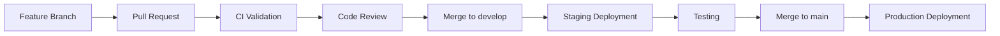

# Cloud Build Automated CI/CD Setup Guide

This guide provides step-by-step instructions to set up the automated CI/CD pipeline for the Neemee frontend using Google Cloud Build.

## Prerequisites ✅

The following prerequisites have been completed:

- [x] **APIs Enabled**: Cloud Build, Cloud Run, Secret Manager APIs
- [x] **IAM Permissions**: Cloud Build service account granted `run.admin` and `secretmanager.secretAccessor`
- [x] **Build Configs**: Created `cloudbuild-ci.yaml`, `cloudbuild-staging.yaml`, `cloudbuild-production.yaml`

## Step 1: Complete GitHub OAuth Connection

The GitHub connection has been created for the Paul-Bonneville-Labs organization:

1. **Complete OAuth Setup**:
   - Visit: https://console.cloud.google.com/cloud-build/triggers
   - Complete the GitHub OAuth connection for `paul-bonneville-labs-connection`
   - **Important**: When authorizing, select the **Paul-Bonneville-Labs** organization
   - Grant access to the `neemee` repository

2. **Verify Connection**:
   ```bash
   gcloud builds connections describe paul-bonneville-labs-connection --region=us-central1
   ```

## Step 2: Create Cloud Build Triggers (Automated)

**Option A: Automated Script (Recommended)**
```bash
# Run the automated setup script
./setup-triggers.sh
```

**Option B: Manual gcloud Commands**
```bash
# Create repository connection
gcloud builds repositories create neemee-repo \
  --connection=paul-bonneville-labs-connection \
  --region=us-central1 \
  --remote-uri=https://github.com/Paul-Bonneville-Labs/neemee.git

# Create CI trigger
gcloud builds triggers create github \
  --repository-name=neemee-repo \
  --repository-owner=Paul-Bonneville-Labs \
  --pull-request-pattern=".*" \
  --build-config=frontend/cloudbuild-ci.yaml \
  --name=neemee-frontend-ci \
  --description="CI validation for all pull requests" \
  --service-account="860937201650@cloudbuild.gserviceaccount.com" \
  --region=us-central1

# Create staging trigger  
gcloud builds triggers create github \
  --repository-name=neemee-repo \
  --repository-owner=Paul-Bonneville-Labs \
  --branch-pattern="^develop$" \
  --build-config=frontend/cloudbuild-staging.yaml \
  --name=neemee-frontend-staging \
  --description="Automatic staging deployment" \
  --service-account="860937201650@cloudbuild.gserviceaccount.com" \
  --region=us-central1

# Create production trigger
gcloud builds triggers create github \
  --repository-name=neemee-repo \
  --repository-owner=Paul-Bonneville-Labs \
  --branch-pattern="^main$" \
  --build-config=frontend/cloudbuild-production.yaml \
  --name=neemee-frontend-production \
  --description="Automatic production deployment with safety checks" \
  --service-account="860937201650@cloudbuild.gserviceaccount.com" \
  --region=us-central1
```

### Manual Console Configuration (Alternative)

If you prefer using the console, create **3 triggers** with the following configurations:

### 🔧 Trigger 1: CI Validation (Pull Requests)

```
Name: neemee-frontend-ci
Description: CI validation for all pull requests
Event: Pull request
Source Repository: Paul-Bonneville-Labs/neemee
Base branch: .* (any branch)
Head branch: .* (any branch)
Configuration: Cloud Build configuration file (yaml or json)
Configuration file location: frontend/cloudbuild-ci.yaml
Service account: 860937201650@cloudbuild.gserviceaccount.com
```

**Advanced Settings:**
- Include logs with status: ✅ Enabled
- Filter: None needed

### 🧪 Trigger 2: Staging Deployment 

```
Name: neemee-frontend-staging
Description: Automatic staging deployment
Event: Push to branch
Source Repository: Paul-Bonneville-Labs/neemee
Branch: ^develop$
Configuration: Cloud Build configuration file (yaml or json)
Configuration file location: frontend/cloudbuild-staging.yaml
Service account: 860937201650@cloudbuild.gserviceaccount.com
```

**Advanced Settings:**
- Include logs with status: ✅ Enabled
- Filter: None needed

### 🚀 Trigger 3: Production Deployment

```
Name: neemee-frontend-production
Description: Automatic production deployment with safety checks
Event: Push to branch
Source Repository: Paul-Bonneville-Labs/neemee
Branch: ^main$
Configuration: Cloud Build configuration file (yaml or json)
Configuration file location: frontend/cloudbuild-production.yaml
Service account: 860937201650@cloudbuild.gserviceaccount.com
```

**Advanced Settings:**
- Include logs with status: ✅ Enabled
- Filter: None needed

## Step 3: Verify Trigger Setup

After creating the triggers, verify the configuration:

```bash
# List all Cloud Build triggers
gcloud builds triggers list

# Check trigger details
gcloud builds triggers describe neemee-frontend-ci
gcloud builds triggers describe neemee-frontend-staging
gcloud builds triggers describe neemee-frontend-production
```

## Step 4: Test the Pipeline

### Testing CI Validation

1. Create a feature branch and make changes
2. Open a Pull Request → Should trigger `neemee-frontend-ci`
3. Check build status in GitHub PR and Cloud Build console

### Testing Staging Deployment

1. Push changes to `develop` branch → Should trigger `neemee-frontend-staging`
2. Monitor deployment at: `https://neemee-frontend-staging-860937201650.us-central1.run.app`
3. Check Cloud Build logs for deployment status

### Testing Production Deployment

1. Push changes to `main` branch → Should trigger `neemee-frontend-production`
2. Monitor deployment at: `https://neemee.paulbonneville.com`
3. Verify zero-downtime deployment and health checks

## Monitoring Deployments

### Cloud Build Console
- **Build History**: https://console.cloud.google.com/cloud-build/builds
- **Trigger History**: https://console.cloud.google.com/cloud-build/triggers

### Command Line Monitoring

```bash
# View recent builds
gcloud builds list --limit=10

# View specific build logs
gcloud builds log $BUILD_ID

# Monitor Cloud Run services
gcloud run services list --region=us-central1

# View service logs
gcloud logs tail --follow --service=neemee-frontend --region=us-central1
gcloud logs tail --follow --service=neemee-frontend-staging --region=us-central1
```

## Deployment Workflow

### Development Workflow



### Branch Strategy

| Branch | Purpose | Deployment |
|--------|---------|------------|
| `feature/*` | New features and bug fixes | CI validation only |
| `develop` | Integration and testing | Auto-deploy to staging |
| `main` | Production-ready code | Auto-deploy to production |

## Troubleshooting

### Common Issues

**Build fails with "No such file or directory":**
- Ensure build config paths are correct relative to repository root
- Check that `frontend/cloudbuild-*.yaml` files exist

**Permission denied errors:**
- Verify Cloud Build service account has required IAM roles
- Check that secrets exist in Secret Manager with correct names

**Deployment fails with health check errors:**
- Check Cloud Run service logs for application errors
- Verify all required secrets are properly configured
- Ensure database connectivity

### Debug Commands

```bash
# Check Cloud Build service account permissions
gcloud projects get-iam-policy paulbonneville-com \
  --flatten="bindings[].members" \
  --filter="bindings.members:860937201650@cloudbuild.gserviceaccount.com"

# List all secrets
gcloud secrets list

# Check secret access
gcloud secrets versions access latest --secret="neemee-database-url"
```

## Next Steps

After setting up the triggers:

1. **✅ Create `develop` branch** if it doesn't exist
2. **✅ Test CI pipeline** with a pull request
3. **✅ Test staging deployment** by pushing to `develop`
4. **✅ Test production deployment** by pushing to `main`
5. **✅ Update team workflow** to use automated deployments

## Security Notes

- **Secrets**: All secrets are managed via Google Cloud Secret Manager
- **Access Control**: Cloud Build service account has minimal required permissions
- **Audit Trail**: All deployments are logged and traceable
- **Rollback**: Automatic rollback on failed health checks in production

---

**🎯 Goal**: Replace unreliable manual deployment scripts with robust, automated CI/CD pipeline

**✅ Benefits**: 
- Consistent deployments
- Zero-downtime production updates
- Automatic health checks and rollbacks
- Complete audit trail
- No local environment dependencies